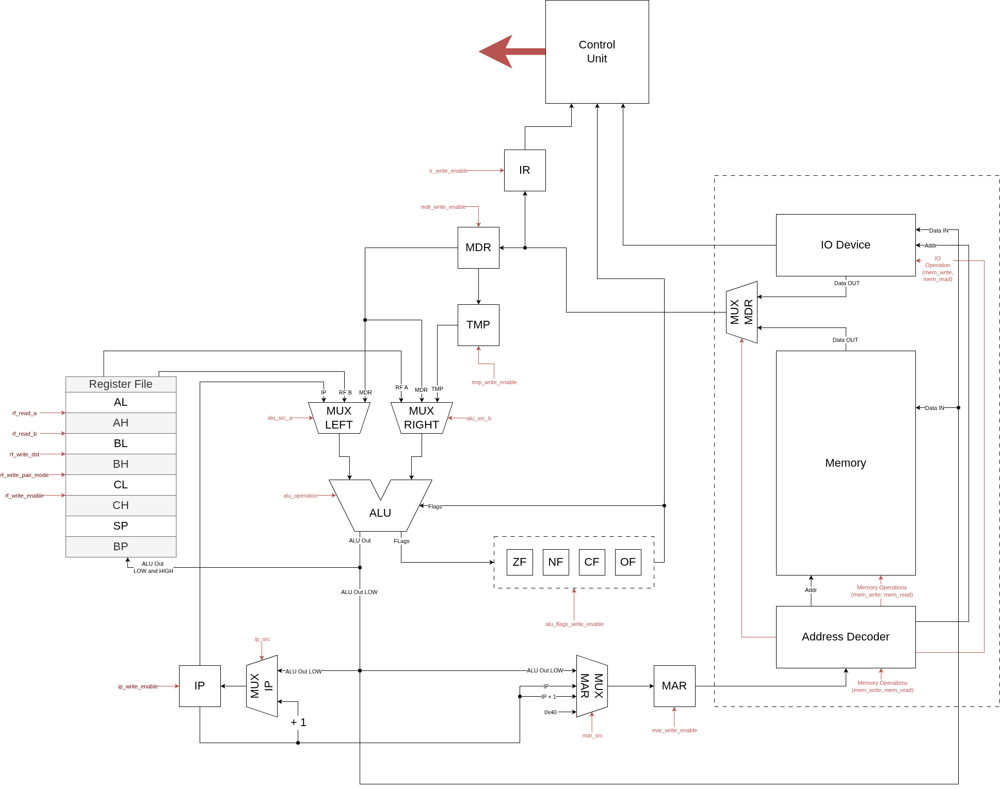
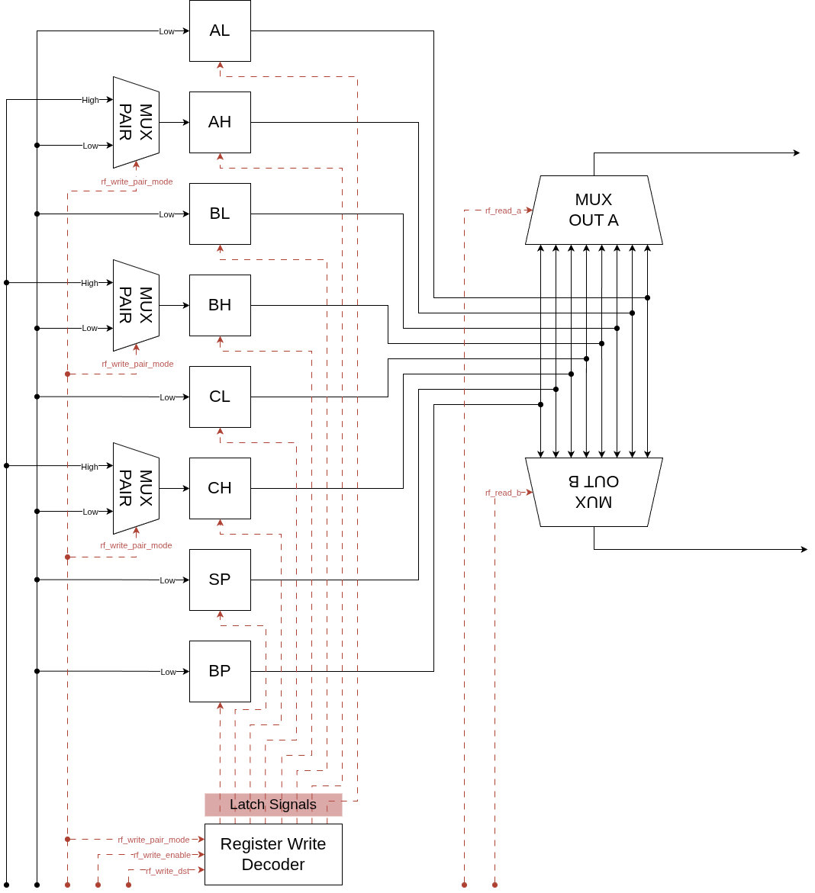
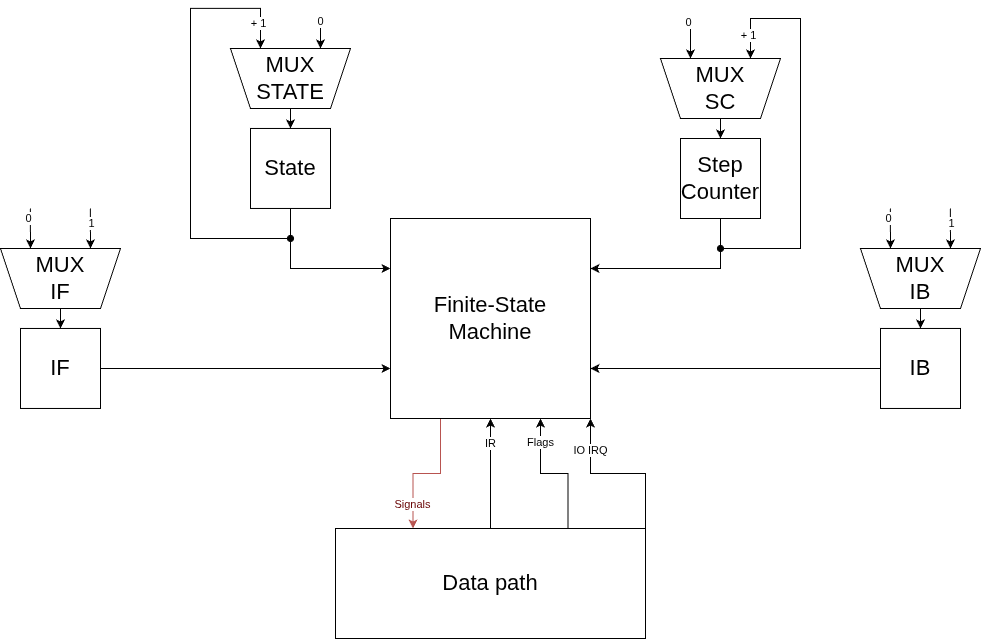

# SCAC. Транслятор и модель

- Кириченко Тимофей Тарасович P3231
- `alg | cisc | neum | hw | tick | binary | trap | mem | cstr | prob1 | vector`

---

## Язык программирования

Язык максимально упрощён, сильно вдохновлён Fortran. Каждая конструкция парсится однозначно по первому слову. Язык поддерживает только процедуры. Чтоб вернуть значение из процедуры, нужно явно передать адрес памяти куда писать, и уже внутри самой процедуры разыменовать его 

### Синтаксис

```ebnf
program         ::= { top_level_decl }

top_level_decl  ::= procedure_decl
                  | var_decl
                  | array_decl

procedure_decl  ::= "PROCEDURE" ident { ident } NEWLINE block

block           ::= { statement }

statement       ::= var_decl
                  | array_decl
                  | assignment
                  | indexed_assignment
                  | if_stmt
                  | loop_stmt
                  | call_stmt
                  | "STOP"
                  | "RETURN"

var_decl        ::= "VARIABLE" ident NEWLINE
array_decl      ::= "ARRAY" ident number NEWLINE

assignment      ::= ident "=" expression NEWLINE
indexed_assignment ::= "[" expression "]" ident "=" expression NEWLINE

if_stmt         ::= "IF" expression NEWLINE block [ "ELSE" NEWLINE block ]
loop_stmt       ::= "LOOP" NEWLINE block
call_stmt       ::= "CALL" ident { ("," | expression) } NEWLINE

expression      ::= term { operator term }
                  | "(" expression ")"
                  | "REF" ident
                  | "[" expression "]" ident
                  | string_literal
                  | number
                  | ident

term            ::= number | ident | "(" expression ")" | "[" expression "]" ident

operator        ::= "ADD" | "SUB" | "MUL" | "DIV" | "MOD"
                  | "EQ"  | "NEQ" | "LT"  | "GT"  | "LTEQ" | "GTEQ"
                  | "AND" | "OR"

ident           ::= letter { letter | digit | "_" }
number          ::= digit { digit }
string_literal  ::= '"' { any_char } '"'
```

Структура файла определяется **отступами**: блок тела процедуры/if/loop начинается с увеличения отступа минимум на 1 пробел и заканчивается при возврате к предыдущему уровню. Комментарии начинаются с `!` и идут до конца строки.

### Семантика

**Стратегия вычислений** -- строгая (eager evaluation), слева направо. Все аргументы вычисляются до вызова процедуры.

**Области видимости:**
- Глобальные переменные и массивы, объявленные вне процедур, видны из любого места программы.
- Локальные переменные и массивы, объявленные внутри процедуры, размещаются на стеке и видны только внутри неё.
- Локальные переменные имеёт область видимости в блок
- Аргументы процедуры передаются по значению (через стек). Передача по ссылке реализуется через ключевое слово `REF`, передающее адрес переменной.

**Типизация:**
- Все переменные имеют единственный тип -- 16-битное знаковое слово.
- `ARRAY name N` объявляет массив из N слов. Доступ к элементу: `[expr]name`.
- Строковые литералы сохраняются в секции данных как последовательность 16-битных кодовых единиц UTF-16 с нулевым терминатором (C-string).

**Структура управления:**
- `LOOP … STOP` -- бесконечный цикл с выходом по `STOP`.
- `IF expr … ELSE …` -- условный переход; ветка `ELSE` опциональна.
- `CALL name arg1, arg2 …` -- вызов процедуры; `RETURN` -- возврат.
- `STOP` внутри `LOOP` -- выход из цикла.

**Обязательные процедуры:**
- `MAIN` -- точка входа программы.
- `IO_ISR` -- обязательный обработчик прерываний ввода-вывода (если используется ввод через прерывания).

---

## Организация памяти

Процессор использует **фон Неймановскую** (единую) модель памяти: инструкции и данные разделяют одно 16-битное адресное пространство объёмом 65 536 слов (128 КиБ).

```text
       Registers
+------------------------------+
| AL, AH, BL, BH, CL, CH      |  General purpose (16 bit each)
+------------------------------+
| SP                           |  Stack Pointer
| BP                           |  Base Pointer
+------------------------------+
| IP (hidden)                  |  Instruction Pointer
| IR (hidden)                  |  Instruction Register
| MAR, MDR, TMP (hidden)       |  Memory/pipeline registers
+------------------------------+
| FLAGS: ZF, NF, CF, OF        |  ALU flags (hidden)
+------------------------------+

       Unified Memory (word = 16 bit, address space = 65536 words)
+------------------------------+
| 0x0000 : ...                 |
| ...                          |
| 0x0040 : IO_IRQ_ADDR         |  Вектор прерывания ввода-вывода
| ...                          |
| 0x0080 : IO_READ             |  Memory-mapped порт чтения ввода
| 0x0081 : IO_WRITE            |  Memory-mapped порт записи вывода
| ...                          |
| 0x0000–0x003F : init code    |  Загрузчик (≤63 слов): инициализация SP,
|                               |  привязка IO_ISR, вызов MAIN
| 0x0100 : program start       |  Начало пользовательской программы:
|   procedures ...             |    код процедур (инструкции)
|   global variables ...       |    глобальные данные (переменные и массивы)
|   string literals ...        |    строковые литералы (UTF-16 + 0x0000)
| ...                          |
| 0xFFFF : (top of stack)      |  Стек растёт вниз от 0xFFFF
+------------------------------+
```

**Работа с памятью по категориям:**

- **Литералы.** Числовые литералы используются через непосредственную адресацию (`Imm-to-Reg`, вторым словом инструкции). Строковые литералы сохраняются транслятором в секцию данных (после глобальных переменных) и доступны по адресу, загружаемому инструкцией `MOV` с непосредственным адресом.
- **Глобальные переменные.** Размещаются статически в памяти после кода всех процедур, начиная с адреса, смещённого от 0x0100. Транслятор сопоставляет имя метке (метка = адрес слова).
- **Глобальные массивы.** Размещаются рядом с переменными; `ARRAY name N` занимает N слов. Обращение `[expr]name` транслируется в `MOV` с режимом `MemRA-to-Reg` / `Reg-to-MemRA`.
- **Локальные переменные.** Размещаются на стеке: `ENTER #n` уменьшает SP на n слов, выделяя фрейм. Обращение через смещение от BP (`MemRA-to-Reg`/`Reg-to-MemRA` с базой BP).
- **Процедуры.** Код каждой процедуры располагается в инструкционной секции, начиная с метки имени процедуры. Пролог: `ENTER #n` + сохранение callee-save регистров (AL, AH, BL, BH, CL, CH через PUSH). Эпилог: восстановление регистров + `LEAVE` + `RET` (при наличии аргументов -- `RET #n` для очистки стека).
- **Прерывания.** Вектор прерывания хранится по адресу `0x0040`. При инициализации загрузчик записывает туда адрес обёртки `__io_isr_wrapper`. Обработчик прерывания сохраняет FLAGS и IP на стек (9 тактов), загружает адрес из `0x0040` в IP.

---

## Система команд

Процессор сильно вдохновлён БЭВМ и Intel 8086

### Особенности процессора

- **CISC-архитектура**: инструкция может занимать 1, 2 или 3 слова в зависимости от режима адресации. Каждая инструкция выполняется микрокодово (несколько тактов через конечный автомат ControlUnit).
- **Регистровый файл**: 6 регистров общего назначения (AL, AH, BL, BH, CL, CH) + SP + BP. Все 16-битные.
- **Флаги**: ZF (ноль), NF (знак), CF (перенос), OF (переполнение). Хранятся в скрытом регистре, сохраняются на стек при прерывании.
- **Ввод-вывод**: memory-mapped. Порт чтения -- адрес `0x80`, порт записи -- `0x81`. Прерывание по входному событию -- вектор в `0x40`.
- **Поток управления**: последовательное выполнение (IP инкрементируется после каждой инструкции), безусловные/условные переходы, вызов/возврат через стек, прерывания.
- **Стек**: растёт вверх (т.е. в обратном порядке памяти 10, 9, 8...). `PUSH` уменьшает SP, `POP` увеличивает.

### Кодирование инструкций

Базовое слово инструкции -- 16 бит:

```text
┌──────────────┬──────────────┬───────────┬───────────┐
│  15 ... 10   │   9  ...  6  │  5 ...  3 │  2 ...  0 │
├──────────────┼──────────────┼───────────┼───────────┤
│    opcode    │     mode     │    Rd     │    Rs     │
│   (6 bits)   │   (4 bits)   │  (3 bit)  │  (3 bit)  │
└──────────────┴──────────────┴───────────┴───────────┘
```

Дополнительные слова (если есть) следуют непосредственно за базовым.

Если инструкция имеет доп. слово - адрес. То адрес всегда указывается вторым словом и только потом данные


**Режимы адресации:**

| Опкод | Режим          | Доп. слов | Доп. тактов | Описание            |
|:-----:|:---------------|:---------:|:-----------:|:--------------------|
| 0x0   | Reg-to-Reg     |     0     |      0      | Rd ← Rs             |
| 0x1   | Imm-to-Reg     |     1     |      1      | Rd ← #imm           |
| 0x2   | MemR-to-Reg    |     0     |      3      | Rd ← [Rs]           |
| 0x3   | MemA-to-Reg    |     1     |      4      | Rd ← [addr]         |
| 0x4   | MemRA-to-Reg   |     1     |      4      | Rd ← [Rs+off]       |
| 0x5   | Reg-to-MemR    |     0     |      3      | [Rd] ← Rs           |
| 0x6   | Imm-to-MemR    |     1     |      4      | [Rd] ← #imm         |
| 0x7   | Reg-to-MemA    |     1     |      4      | [addr] ← Rs         |
| 0x8   | Imm-to-MemA    |     2     |      5      | [addr] ← #imm       |
| 0x9   | Reg-to-MemRA   |     1     |      4      | [Rd+off] ← Rs       |
| 0xA   | Imm-to-MemRA   |     2     |      5      | [Rd+off] ← #imm     |

### Набор инструкций

> Базовая задержка каждой инструкции = 2 такта (фаза InstructionFetch). Колонка Доп. такты -- дополнительнaя задержка от Fetch доп. слов и от самого Exec.

**Системные:**

| Инструкция | Опкод | Режим      | Длина | Доп. такты | Описание                |
|:-----------|:-----:|:----------:|:-----:|:----------:|:------------------------|
| NOP        | 0x00  | Reg-to-Reg |   1   |      1     | Нет операции            |
| HLT        | 0x01  | Reg-to-Reg |   1   |      1     | Останов процессора      |

**Пересылка данных:**

| Инструкция       | Опкод | Режим | Длина         | Доп. такты      | Описание   |
|:-----------------|:-----:|:-----:|:-------------:|:---------------:|:-----------|
| MOV dst, src     | 0x02  | ANY   | 1+mode length | 1 + mode delay  | dst ← src  |

**Арифметика:**

| Инструкция       | Опкод | Режим      | Длина         | Флаги     | Описание                           |
|:-----------------|:-----:|:----------:|:-------------:|:---------:|:-----------------------------------|
| ADD dst, src     | 0x03  | ANY        | 1+mode length | ZF NF CF OF | dst ← dst + src                  |
| ADDC dst, src    | 0x04  | ANY        | 1+mode length | ZF NF CF OF | dst ← dst + src + CF             |
| SUB dst, src     | 0x05  | ANY        | 1+mode length | ZF NF CF OF | dst ← dst − src                  |
| SUBC dst, src    | 0x06  | ANY        | 1+mode length | ZF NF CF OF | dst ← dst − src − CF             |
| MUL Rd, src      | 0x07  | ANY-to-Reg | 1+mode length | ZF NF CF OF | Rd+1:Rd ← Rd × src              |
| DIV Rd, src      | 0x08  | ANY-to-Reg | 1+mode length | ZF NF      | Rd ← Rd÷src; Rd+1 ← remainder   |
| INC Rd, Rs       | 0x09  | Reg-to-Reg | 1             | ZF NF OF  | Rd ← Rs + 1                      |
| DEC Rd, Rs       | 0x0A  | Reg-to-Reg | 1             | ZF NF OF  | Rd ← Rs − 1                      |
| NEG Rd, Rs       | 0x0B  | Reg-to-Reg | 1             | ZF NF CF OF | Rd ← −Rs                       |

**Логика:**

| Инструкция       | Опкод | Описание                  |
|:-----------------|:-----:|:--------------------------|
| AND dst, src     | 0x0C  | dst ← dst & src           |
| OR dst, src      | 0x0D  | dst ← dst \| src          |
| XOR dst, src     | 0x0E  | dst ← dst ^ src           |
| NOT dst, src     | 0x0F  | dst ← ~src                |
| SHL dst, #off    | 0x10  | dst ← dst << #off         |
| SHR dst, #off    | 0x11  | dst ← dst >> #off         |

**Сравнение:**

| Инструкция       | Опкод | Описание                      |
|:-----------------|:-----:|:------------------------------|
| CMP dst, src     | 0x14  | dst − src, только установка флагов |
| TEST dst, src    | 0x15  | dst & src, только установка флагов |

**Управление потоком:**

| Инструкция  | Опкод | Условие                  | Описание              |
|:------------|:-----:|:------------------------:|:----------------------|
| JMP #addr   | 0x16  | безусловный              | IP ← #addr            |
| JE #addr    | 0x17  | ZF=1                     |                       |
| JNE #addr   | 0x18  | ZF=0                     |                       |
| JNS #addr   | 0x19  | NF=1                     |                       |
| JNC #addr   | 0x1A  | NF=0                     |                       |
| JCS #addr   | 0x1B  | CF=1                     |                       |
| JCC #addr   | 0x1C  | CF=0                     |                       |
| JOS #addr   | 0x1D  | OF=1                     |                       |
| JOC #addr   | 0x1E  | OF=0                     |                       |
| JL #addr    | 0x1F  | NF≠OF                    |                       |
| JLE #addr   | 0x20  | ZF=1 или NF≠OF           |                       |
| JG #addr    | 0x21  | ZF=0 и NF=OF             |                       |
| JGE #addr   | 0x22  | NF=OF                    |                       |
| CALL #addr  | 0x23  | --                        | SP--; [SP] ← IP; IP ← #addr |
| RET         | 0x24  | --                        | IP ← [SP]; SP++       |
| RET #n      | 0x24  | --                        | IP ← [SP]; SP += 1+#n |

**Стек:**

| Инструкция  | Опкод | Такты | Описание                              |
|:------------|:-----:|:-----:|:--------------------------------------|
| PUSH Rd     | 0x25  |  3+2  | SP--; [SP] ← Rd                       |
| POP Rd      | 0x26  |  4+2  | Rd ← [SP]; SP++                       |
| ENTER #n    | 0x27  |  6+2  | PUSH BP; MOV BP, SP; SUB SP, #n       |
| LEAVE       | 0x28  |  5+2  | MOV SP, BP; POP BP                    |

**Прерывания:**

| Инструкция  | Опкод | Описание                                |
|:------------|:-----:|:----------------------------------------|
| IRET        | 0x2A  | POP IP; POP FLAGS -- возврат из прерывания |
| STI         | 0x2B  | IF ← 1 -- разрешить прерывания           |
| CLI         | 0x2C  | IF ← 0 -- запретить прерывания           |

---

## Транслятор

Интерфейс командной строки: `compiler --input <source.shit> --output <target.bin>`

Реализован в crate `compiler` (Rust). Этапы трансляции:

1. **НедоЛексический анализ** (`protolexer`): разбиение на строки с вычислением уровня отступа (степень вложенности блока), удаление комментариев, выделение строковых литералов в отдельный регистр строк.
2. **Синтаксический анализ** (`parser`): рекурсивный нисходящий парсер, строит AST из узлов: `Procedure`, `Block`, `If`, `Loop`, `FnCall`, `Variable`, `VariableSet` и т.д. Отступы заменяют фигурные скобки.
3. **Генерация кода** (`codegen`): обход AST, эмиссия слов инструкций и меток. Глобальные переменные/массивы/строки размещаются после кода процедур.
4. **Линковка** (`linker`): добавление загрузочного кода (инициализация SP = 0xFFFF, привязка вектора прерывания, вызов `MAIN`), разрешение меток, упаковка в бинарный формат (секции offset+size+data).

---

## Модель процессора

Модель полностью симулиpет схему. Control Unit управлет Data Path только через сигналы, а не через вызов функций.
Старался сделать максимально правдоподобно

### DataPath



Реализован в структуре `DataPath`. Однопортовая память: за один такт либо читаем, либо пишем.

Сигналы (управляются ControlUnit за один такт):
- `ir_write_enable` -- защёлкнуть mem_out в IR;
- `rf_write_enable` / `rf_read_a` / `rf_read_b` -- чтение/запись регистрового файла;
- `rf_write_pair_mode` -- запись пары регистров (для MUL/DIV);
- `alu_operation`, `alu_src_a`, `alu_src_b`, `alu_flags_write_enable` -- управление АЛУ;
- `mar_src`, `mar_write_enable` -- выбор источника MAR (IP / IP+1 / ALU out / IO_IRQ);
- `mdr_write_enable`, `tmp_write_enable` -- защёлка MDR и TMP;
- `mem_read`, `mem_write` -- доступ к памяти;
- `ip_src`, `ip_write_enable` -- обновление счётчика команд.

### RegisterFile


### ControlUnit



Реализован в структуре `ControlUnit`. Hardwired (вся логика -- на Rust).

Состояния конечного автомата:
- `InstructionFetch` -- загрузка слова из памяти по IP в IR, инкремент IP; параллельно проверяется запрос прерывания.
- `InstructionAnalyze` -- декодирование IR; определяется длина инструкции и режим.
- `SecondWordFetch` / `ThirdWordFetch` -- дополнительные обращения к памяти для загрузки операндов инструкций переменной длины.
- `Exec` -- выполнение инструкции (1–5 тактов в зависимости от режима адресации). Поле `step_counter` отслеживает шаг внутри многотактовой инструкции.
- `Interruption` -- обработка прерывания (9 тактов): PUSH FLAGS, PUSH IP, загрузка вектора из `[0x0040]` в IP.

Прерывание проверяется после завершения каждой инструкции (флаг `io_irq` в DataPath). Во время обработки прерывания (`interruption_block = true`) новые прерывания блокируются. Разблокировка происходит при выполнении `IRET`.

Особенности работы модели:
- Цикл симуляции выполняется в функции `run` (crate `cpu`).
- Шаг моделирования соответствует одному такту процессора.
- Количество тактов лимитировано параметром `--limit` (по умолчанию 1 000 000).
- Остановка при: превышении лимита тактов; выполнении инструкции `HLT`.

---

## Тестирование

Тестирование выполняется с помощью golden tests.

Тесты реализованы в: [test-runner.py](./test-runner.py). Конфигурации:
- [golden/hello.yaml](golden/hello.yaml) -- вывод строки `hello, world!`
- [golden/cat.yaml](golden/cat.yaml) -- посимвольный эхо ввода
- [golden/hello_user_name.yaml](golden/hello_user_name.yaml) -- интерактивный ввод имени
- [golden/sort.yaml](golden/sort.yaml) -- сортировка пузырьком входного массива
- [golden/euler4.yaml](golden/euler4.yaml) -- Задача Эйлера #4 (наибольший палиндром, произведение двух трёхзначных чисел)
- [golden/math_32bit.yaml](golden/math_32bit.yaml) -- 32-битная арифметика через пары регистров

Запустить тесты: `python3 test-runner.py`

Пример использования транслятора:

```shell
$ cargo run --bin compiler -- -s examples/hello.shit -o out/hello.bin
$ cargo run --bin cpu -- -b out/hello.bin -o out/mem.log
out/mem.log: ...
```

Пример вывода модели при запуске с отладкой (`--debug`):

```shell
$ cpu --bin out -d | head -n 75

Tick 0
	State: InstructionFetch (0)
	nop     regtoreg    AL  AL
	IR:  0x0
	IF:  false    IB:  false    IRQ: false
	IP:  0x0      MAR: 0x0
	MDR: 0x0      TMP: 0x0
	AL:  0x0      AH:  0x0
	BL:  0x0      BH:  0x0
	CL:  0x0      CH:  0x0
	SP:  0x0      BP:  0x0
	Z: false, N: false, C: false, O: false
	Mem[SP..SP+10]: [2160, 65535, 35904, 292, 1024, 0, 0, 0, 0, 0]


Tick 1
	State: InstructionFetch (1)
	nop     regtoreg    AL  AL
	IR:  0x0
	IF:  false    IB:  false    IRQ: false
	IP:  0x0      MAR: 0x0
	MDR: 0x0      TMP: 0x0
	AL:  0x0      AH:  0x0
	BL:  0x0      BH:  0x0
	CL:  0x0      CH:  0x0
	SP:  0x0      BP:  0x0
	Z: false, N: false, C: false, O: false
	Mem[SP..SP+10]: [2160, 65535, 35904, 292, 1024, 0, 0, 0, 0, 0]


Tick 2
	State: InstructionAnalyze (0)
	mov     immtoreg    SP  AL
	IR:  0x870
	IF:  false    IB:  false    IRQ: false
	IP:  0x1      MAR: 0x0
	MDR: 0x0      TMP: 0x0
	AL:  0x0      AH:  0x0
	BL:  0x0      BH:  0x0
	CL:  0x0      CH:  0x0
	SP:  0x0      BP:  0x0
	Z: false, N: false, C: false, O: false
	Mem[SP..SP+10]: [2160, 65535, 35904, 292, 1024, 0, 0, 0, 0, 0]


Tick 3
	State: SecondWordFetch (0)
	mov     immtoreg    SP  AL
	IR:  0x870
	IF:  false    IB:  false    IRQ: false
	IP:  0x1      MAR: 0x1
	MDR: 0x0      TMP: 0x0
	AL:  0x0      AH:  0x0
	BL:  0x0      BH:  0x0
	CL:  0x0      CH:  0x0
	SP:  0x0      BP:  0x0
	Z: false, N: false, C: false, O: false
	Mem[SP..SP+10]: [2160, 65535, 35904, 292, 1024, 0, 0, 0, 0, 0]


Tick 4
	State: Exec (0)
	mov     immtoreg    SP  AL
	IR:  0x870
	IF:  false    IB:  false    IRQ: false
	IP:  0x2      MAR: 0x2
	MDR: 0xffff   TMP: 0x0
	AL:  0x0      AH:  0x0
	BL:  0x0      BH:  0x0
	CL:  0x0      CH:  0x0
	SP:  0x0      BP:  0x0
	Z: false, N: false, C: false, O: false
	Mem[SP..SP+10]: [2160, 65535, 35904, 292, 1024, 0, 0, 0, 0, 0]
```

Пример golden-теста (`golden/hello.yaml`):

```yaml
src: |
  PROCEDURE WRITE CHAR
    VARIABLE OUT_ADDR
    OUT_ADDR = 129
    [0]OUT_ADDR = CHAR

  PROCEDURE MAIN
    VARIABLE HELLO
    HELLO = "hello, world!"
    LOOP
      VARIABLE CHAR
      CHAR = [0]HELLO
      IF CHAR EQ 0
        STOP
      CALL WRITE CHAR
      HELLO = HELLO ADD 1

limit: 1000000
input: {}
cpu_out: [104, 101, 108, 108, 111, 44, 32, 119, 111, 114, 108, 100, 33]
cpu_log_limit: none
```
